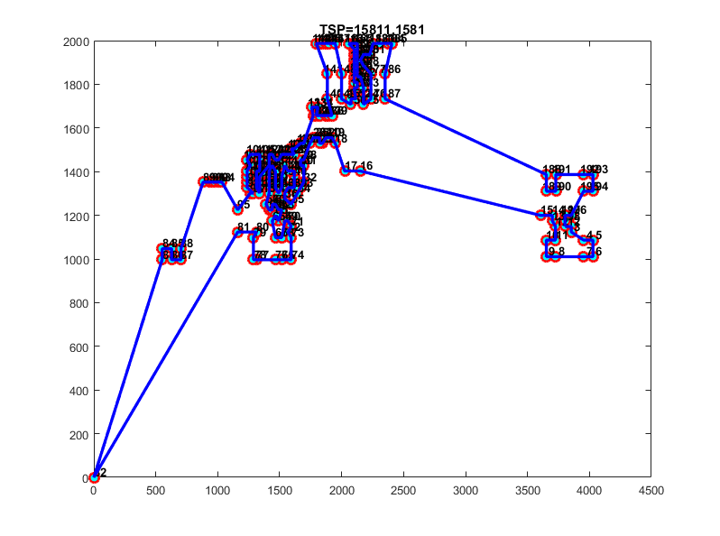

# EMF-CE

> here, a novel search algorithm that based on Contraction-Expansion algorithm and integrated three operators Exchange, Move and Flip (EMF-CE) is proposed for the traveling salesman problem (TSP). EMF-CE uses a negative exponent function to generate critical value as the feedback regulation of algorithm implementation. Also, combined Exchange Step, Move step with Flip step and constitute of more than twenty combinatorial optimization of program elements. It has been shown that the integration of local search operators can significantly improve the performance of EMF-CE for TSPs. We  test small and medium scale (51-1000 cities) TSPs were taken from the TSPLIB online library. The experimental results show the efficiency of the proposed EMF-CE for addressing TSPs in comparison with other state-of-the-art algorithms.

### demo

```matlab
# only run once
$ EMFCE('../pr124.tsp','diary.txt',59030)

# run 10 times
$EMFCE('../pr124.tsp','diary.txt',59030,10)

```
### Figs

- KROA100.tsp


- XQF131.tsp


- d198.tsp



- pa561.tsp


