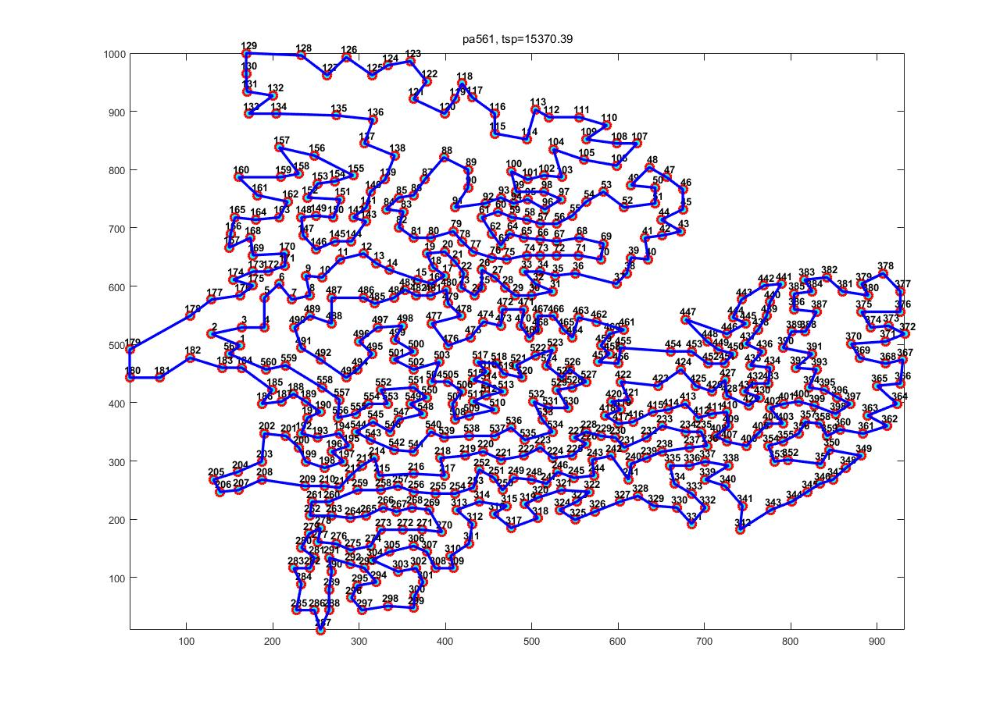

# EMF-CE

### demo

```matlab
# only run once
$ EMFCE('../pr124.tsp','diary.txt',59030)

# run 10 times
$EMFCE('../pr124.tsp','diary.txt',59030,10)

```
### Figs

- KROA100.tsp


- XQF131.tsp


- d198.tsp


- pa561.tsp


